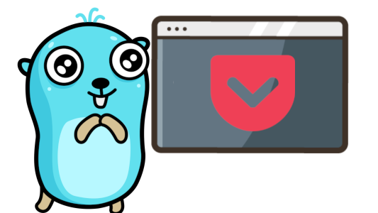

# WIP - this is not ready yet :)

# Gocket

A simple CLI (or TUI) for Pocket.



## Installation

### General

You can simply grab the [latest binary file](https://github.com/Phantas0s/gocket/releases/latest) and download the version you need, depending on your OS.

### Linux script

If you use a Linux-based OS, here's a simple way to download gocket and move it to `/usr/local/bin`. You can then call it wherever you want.

```shell
curl -LO https://raw.githubusercontent.com/Phantas0s/gocket/master/install/linux.sh && \
./linux.sh && \
rm linux.sh
```
### Manual installation

You need to clone this repository and build the binary in the root directory.

## Authorization

You need to authorize gocket to access your Pocket account. It's very easy:

### Steps

1. Go to [Gocket apps and create an application](https://getpocket.com/developer/apps/)
2. Authorize the application to add, modify, and retrieve if you want to use the full set of gocket's feature
3. You need to pass the consumer key to pocket each time you use it (`-k` option) or you can use a config file:
    1. Create the file `$XDG_CONFIG_HOME/gocket/config.yml`
    2. Create an entry with `key` as index and the consumer key as value, for example `key: 1234-5a6b7c`
    3. Your config can be a YAML, TOML, or JSON file
3. The first time you use pocket, you'll need to confirm your authorization. A webpage will open automatically in your favorite browser to do so
4. Enjoy!

### XDG Home Directory

The value of `$XDG_CONFIG_HOME` depends of your OS. Here are the defaults (if you didn't modify it):

* **Unix systems**: `~/.config`
* **macOS**: `~/Library/Application Support`
* **Windows**: `%LOCALAPPDATA%`

## Commands

You have access to different commands. Use the option `-h` for each command to access the help.

### List

`gocket list`: list your Pocket entries.
`gocket list archive`: list the archives.

The options for these two commands are almost identical.

### Add

`gocket add <URL>`: Add the URL `<URL>` to pocket.

## Usage

| Description                                       | Command                                                |
| ----                                              | ----                                                   |
| Output every page's URLs                          | `gocket list`                                          |
| Output the last 5 pages' URLs added               | `gocket list -c 5`                                     |
| Display the last 5 pages added in a TUI           | `gocket list -c 5 --tui`                               |
| Search for "youtube" in titles and URLs           | `gocket list -s "youtube" -t`                          |
| Open the last page added with Firefox             | `gocket list -c 1 &#x7c; xargs firefox`                |
| Open the last page added with Lynx                | `gocket list -c 1 &#x7c; lynx -`                       |
| Open the oldest page added with Firefox           | `gocket list -c 1 -o "oldest" &#x7c; xargs firefox`    |
| Open the last 5 pages with Firefox and archive it | `gocket list -c 5 -a --noconfirm &#x7c; xargs firefox` |
| Open the last page with Firefox and delete it     | `gocket list -c 1 -d --noconfirm &#x7c; xargs firefox` |

## TUI Keybindings


## Video Tutorial


### Newest Article Using Your Browser

```
gocket list -k <consumerKey> -c 1 | lynx -
gocket list -k <consumerKey> -c 1 | xargs firefox
```

## References

### Pocket List

https://getpocket.com/my-list

### API

https://etpocket.com/developer/docs/authentication
https://getpocket.com/developer/docs/v3/retrieve

### Inspiration

[go-pocket](https://github.com/motemen/go-pocket) has been the base I've refactored and built upon. Thanks for this great project!
https://getpocket.com/developer/apps/

### Libraries

https://pkg.go.dev/github.com/rivo/tview

## Model

Keybindings: https://github.com/jesseduffield/lazydocker/blob/master/docs/keybindings/Keybindings_en.md
