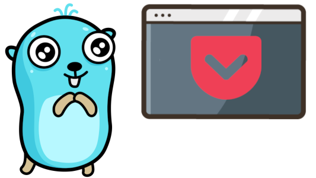

# gocket

[](https://github.com/Phantas0s/gocket/releases/latest)

 [](https://goreportcard.com/report/github.com/Phantas0s/gocket) [](https://www.codacy.com/gh/Phantas0s/gocket/dashboard?utm_source=github.com&amp;utm_medium=referral&amp;utm_content=Phantas0s/gocket&amp;utm_campaign=Badge_Grade) [](https://www.vbrandl.net/post/2019-05-03_hits-of-code/) [](https://opensource.org/licenses/Apache-2.0) 
[](https://twitter.com/intent/tweet?text=Gocket%20-%20CLI%20and%20TUI%20for%20Pocket%20:&url=https%3A%2F%2Fgithub.com%2Fphantas0s%2Fgocket&hashtags=developers,mouseless,terminal,CLI,golang)

A simple CLI (or TUI) for Pocket.

* Read your Pocket goodies from your comfy shell.
* Archive or delete multiple entries easily.
* Use a TUI or pipe the pages' URLs (or titles) to any URL you want.
* Search through your Pocket list.
* Works on Linux, macOS (not tested), and Windows (not tested).

**Gocket is in early version. Its interface might change. See the [CHANGELOG](./CHANGELOG.md)**

## Installation

### General

You can simply grab the [latest binary file](https://github.com/Phantas0s/gocket/releases/latest) and download the version you need, depending on your OS.

### Linux script

If you use a Linux-based OS, here's a simple way to download gocket and move it to `/usr/local/bin`. You can then call it wherever you want.

```shell
curl -L https://raw.githubusercontent.com/Phantas0s/gocket/master/install/linux.sh | bash
```
### Manual installation

* You need the last version of Golang installed.
* You need to clone this repository and build the binary in the root directory with the command `go build`.

## Authorization

You need to authorize gocket to access your Pocket account. It's very easy:

### Steps

1. Go to [Gocket apps and create an application](https://getpocket.com/developer/apps/)
2. Authorize the application to **add**, **modify**, and **retrieve** if you want to use the full set of gocket's feature
3. You need to pass the consumer key to gocket each time you use it (`-k` option) or you can use a config file:
    1. Create the file `$XDG_CONFIG_HOME/gocket/config.yml`
    2. Create an entry with `key` as index and the consumer key as value, for example `key: 1234-5a6b7c`
    3. Your config can be a YAML, TOML, or JSON file
3. The first time you use pocket, you'll need to confirm your authorization. A webpage will open automatically in your favorite browser to do so
4. Enjoy!

### XDG Home Directory

Running `gocket list` without any consumer key will display an error message indicating where to create the config file.

The value of `$XDG_CONFIG_HOME` depends of your OS. Here are the defaults (if you didn't modify it):

* **Unix systems**: `~/.config`
* **macOS**: `~/Library/Application Support`
* **Windows**: `%LOCALAPPDATA%`

## Commands

Use the option `-h` for each command to output the help.

### List

* `gocket list`: list your Pocket pages.
* `gocket list archive`: list the archives.

The options for these two commands are almost identical. Here are the difference:

* Use `-a` with `gocket list` to bulk add every listed entry to the archive (with confirmation).
* Use `-a` with `gocket list archive` to bulk add every listed archive to the unread list (with confirmation).

### Adding New Paes

* `gocket add <URLs...>`: Add the URLs `<URLs....>` to pocket. You can add multiple URLs separated with spaces.

## Usage

If you choose to use the TUI, you can select a page and open it with your favorite browser using the `ENTER` key.

| Description                                                         | Command                              |
| ----                                                                | ----                                 |
| Output every page's URLs                                            | `gocket list`                        |
| Display every page's URLs in a TUI                                  | `gocket list --tui`                  |
| Output the last 5 pages' URLs added                                 | `gocket list -c 5`                   |
| Display pages in a TUI and don't ask confirmation for any operation | `gocket list -c 5 --tui --noconfirm` |
| Search for "youtube" in titles and URLs                             | `gocket list -s "youtube" -t`        |
| Open the last page added with Firefox                               | `gocket list -c 1 \| xargs firefox` |
| Open the last page added with Lynx                                  | `gocket list -c 1 \| lynx -`        |
| Open the oldest page added with Firefox                             | `gocket list -c 1 -o "oldest" \| xargs firefox` |
| Open the last 5 pages with Firefox and archive them                 | `gocket list -c 5 -a --noconfirm \| xargs firefox` |
| Open the last page with Firefox and delete it                       | `gocket list -c 1 -d --noconfirm \| xargs firefox` |
| Print only the pages' titles                                        | `gocket list -c 10 -t \| sed 'n;d'` |

As a bonus for Linux users (might work on macOS too), you can use [fzf](https://github.com/junegunn/fzf) to fuzzy search the page you want and open it with Firefox:

```
gocket list -c 5 -t | sed 'N;s#\n# /// #' | fzf | awk -F ' /// ' '{print $2}' | xargs firefox
```

## Configuration

You can add to the config file `$XDG_CONFIG_HOME/gocket/config.yml` the same options you can add to the CLI. For example, if you always want to use the TUI, you can add:

```
tui: true
```

If you add options already defined in the config file when running the `gocket` command, they will overwrite them. For example, if you have the TUI sets to true in the config and you run `gocket list -c 5 --tui=false`, you won't use the TUI.

In short, using the config file is a nice way to define the default options you want to use while keeping the possibility to overwrite them.

If you don't like YAML, you can use JSON or TOML if you want.

## TUI Keystrokes

### Navigation

<pre>
 <kbd>↑</kbd> or <kbd>k</kbd>: up
 <kbd>↓</kbd> or <kbd>j</kbd>: down
 <kbd>PgUp</kbd> or <kbd>CTRL</kbd>+<kbd>u</kbd>: One screen up
 <kbd>PgDn</kbd> or <kbd>CTRL</kbd>+<kbd>d</kbd>: One screen down
 <kbd>Home</kbd> or <kbd>g</kbd>: Top of the list
 <kbd>End</kbd> or <kbd>G</kbd>: Bottom of the list
</pre>

### Action

<pre>
 <kbd>ENTER</kbd>: Open the selected page with your favorite browser
 <kbd>d</kbd>: Delete Pocket entry
 <kbd>a</kbd>: Add (if list archive) or archive (if list unread)
</pre>

## Sponsorship

Consider [sponsoring my work](https://github.com/sponsors/Phantas0s) if you want to see new, fresh, and crunchy little CLIs (and TUIs) all over your system.

## Shameless Mouseless Plug

Switching between a keyboard and mouse costs cognitive energy. [My book will help you set up a Linux-based development environment](https://themouseless.dev) that keeps your hands on your keyboard. Take the brain power you've been using to juggle input devices and focus it where it belongs: on the things you create.

## Acknowledgements

* Thanks to the project [go-pocket](https://github.com/motemen/go-pocket), it gave me the basic data structures and other ideas.
* Thanks to [MariaLetta](https://github.com/MariaLetta/free-gophers-pack) for the awesome and beautiful Gopher pack! I used it for my logo on top.
* Thanks to [Lukasz Adam](https://lukaszadam.com/illustrations) for his free and amazing illustrations I use basically everywhere.

## Licence

[Apache Licence 2.0](https://choosealicense.com/licenses/apache-2.0/)
